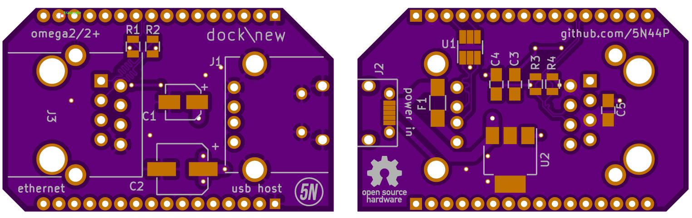

# Omega dock\new

Released under CC-BY-SA 4.0 license  

### Project status
Waiting for the boards from the manifacturer, not tested yet.

### Project description 
This project is a dock, compabile with Onion omega, omega2 and omega2+. It features:  
* Microusb connector for power supply with onboard linear regulation  
* USB host connector  
* Ethernet connector

All in the compact shape of the omega boards.  
The project came out when i was looking for the ethernet expansion board from Onion. 
Their price is 15$ for the ethernet expansion, then you'll need another 20$ for the dock board. 
35$ in total.
That seemed too much for a bunch of connectors and some component, so i decided to make mine.
My board costs about 10-15$ as a prototype (but then you don't have to spend another 20$ for the dock). 
The price should decrease if more boards are fabricated.
